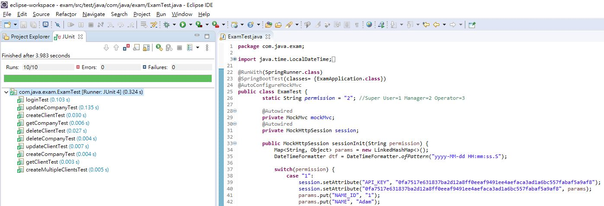

# EXAM 

# 概述

        這是基於SpringBoot與H2 DataBase構建的簡易專案，登入後即可依據權限進行增、刪、改、查等功能，在程式運行後，可透過下方DataBase連接開啟H2 Console，API測是可以透過Swagger進行測試。

>DataBase: http://localhost:8080/h2-console

>Swagger: http://localhost:8080/swagger-ui.html

## 權限劃分:
- Super User     
  　　　Create, Update,Delete, Read  
- Manager  
  　　　Update, Delete, Read  
- Operator    
  　　　Create, Read  
  

# API說明

## Controller

PostController

|/login|登入系統|
|-----|----|
|/createCompany|建立Company|
|/createClient|建立Client|
|/createMultipleClients|建立多Client|

PutController

|/updateCompany|修改Company|
|-----|----|
|/updateClient|修改Client|

GetController   

|/getCompany|查詢Company|
|-----|----|
|/getClient|查詢Client|

DeleteController

|/delCompany|刪除Company|
|-----|----|
|/delClient|刪除Client|

# 功能實現說明

## DB Table

|Table|說明|
|-----|----|
|COMPANY|記錄公司資訊|
|CLIENT|記錄使用者資訊|
|PASSWORD|記錄使用者密碼|
|ROLE|記錄使用者權限|

## 權限管理
> 
>登入時，會使用name與password下DB從CLIENT角色表,密碼表,權限表 三張Table取出登入資訊，並寫入Session
>
>在呼叫各功能時，會先從Session中取出登入資訊，檢查登入時間
>
>當登入時間與當前時間超過五分鐘，噴出"逾時請重新登入訊息"
>
>各功能再由Session紀錄的權限資訊進行判斷是否能使用

## 建立功能

> Step1. 登入 與 權限檢查
>
> Step2. 判斷 必填資訊 是否為空，缺一即回傳403錯誤
>
> Step3. 呼叫查詢功能，確認DB不存在該筆資料(JPA)
>
> Step4. 透過Spring JPA  save資料
>
> Step5. 重新查詢一次，並將結果回傳

### 多筆建立

> 透過Client組成陣列傳入
> 
> Step1. 登入與 權限 檢查
> 
> Step2. 將陣列進行迴圈拆解
> 
> Step3. 每一次拆解，呼叫單次建立流程
> 
> Step4. 透過Map記錄每次結果，回傳

## 更新功能

> Step1. 登入與 權限 檢查
>
> Step2. 用主Key ID查詢DB，確認DB存在該筆資料(JPA)
>
> Step3. 透過Spring JPA save資料
> 
> Step4. 重新查詢一次，並將結果回傳

## 查詢功能

> Step1. 僅進行 登入 檢查
>
> Step2. 判斷 傳入值 是否為空
> 
> Step3. 組織SQL，透過JDBCTemplate進行查詢
>
> Step3. 透過Map將值回傳

## 刪除功能

> Step1. 登入 與 權限檢查
>
> Step2. 用主Key ID查詢DB，確認DB存在該筆資料(JPA)
>
> Step3. 透過Spring JPA delete資料
> 
> Step4. 完成後，回傳刪除成功訊息

# 程式結構說明

|路徑|說明|
---------------|------------------------|
|/com/java/exam|初始化、Main方法、異常處理|
|/com/java/exam/controller|放置Post、Put、Get、Delete接口方法|
|/com/java/exam/Service|放置運作邏輯|
|/com/java/exam/dao|放置SQL查詢方法|
|/com/java/exam/repository|放置JPA查詢方法|
|/com/java/exam/data|放置Company、Client模型|
|/com/java/exam/vo|宣告共用傳遞參數|

# Junit測試

## 測試說明

> com/java/exam/ExamTest.java
>
> 全域宣告 static String permission = "1"; //Super User=1 Manager=2 Operator=3
> 
> 可以藉由修改 1/2/3 進行不同權限測試，針對不同權限在回傳採用不同判斷

|名稱|說明|
---------------|------------------------|
|loginTest|登入測試|
|createCompanyTest|公司建立測試|
|createClientTest|使用者建立測試|
|createMultipleClientsTest|多使用者建立測試|
|updateCompanyTest|更新公司測試|
|updateClientTest|更新使用者測試|
|getCompanyTest|查詢公司測試|
|getClientTest|查詢使用者測試|
|deleteCompanyTest|刪除公司測試|
|deleteClientTest|刪除使用者測試|

## 測試結果

### Super User

### Manager

### Oerator

# 聯繫方式

如有任何疑問與建議。歡迎與我聯繫 e-mail: eaischang@gmail.com